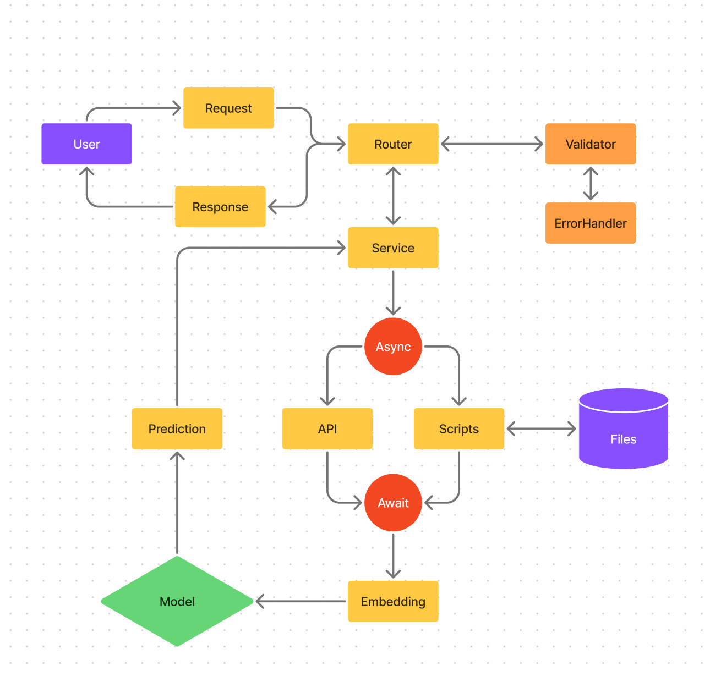
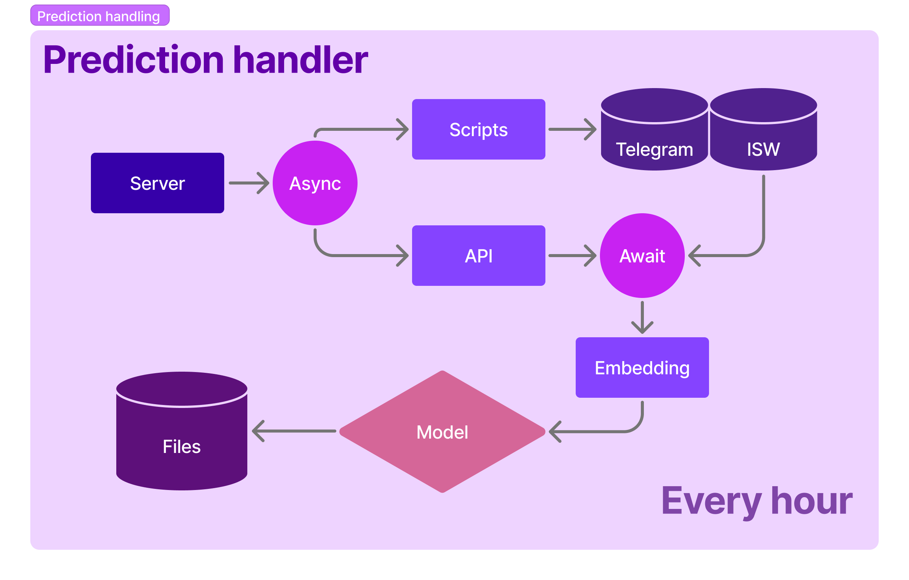
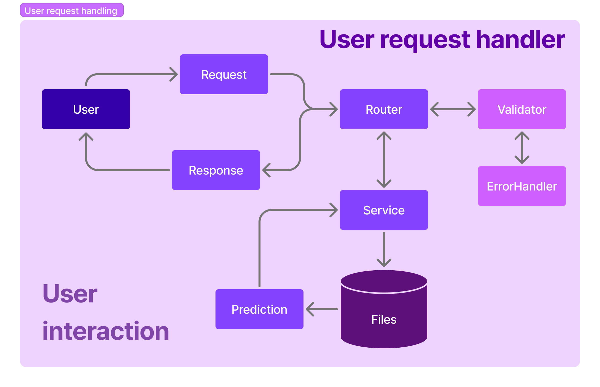

# AirAlarmsApp

### To setup the project follow next steps</h2>

- Clone repository `git clone <path>`
- Go to AirAlarmsApp directory `cd AirAlarmsApp/`
- Create venv `python -m venv <path>` or `.venv python3 -m venv <path>`
- Activate venv `. .venv/bin/activate`
- install required packages `pip install -r requirements.txt`
- create .env file inside AirAlarmsApp directory with such keys (telegram keys are optional):
  - TELEGRAM_API_ID
  - TELEGRAM_API_HASH
  - TELEGRAM_API_PHONE
  - WEATHER_API_KEY
  - ALARMS_API_KEY

### To run the server follow next steps</h2>

- Setup Security Group for your EC2 instance with Custom TCP protocol and port
- Go to app directory `cd app/` (Make sure you are in AirAlarmsApp/ directory with activated venv)
- Run ```uvicorn app:app --reload```

### Setup daily isw scraper </h2>

- Make sure directory `AirAlarmsApp/app/files/isw_reports/full_reports/2025` , `../isw_reports/short_reports` , `../isw_reports/links` exist
- Create file for logs with such path `/home/ubuntu/AirAlarmsApp/files/iswlogs.log`
- Open crontab file with command `crontab -e`
- Copy this line in crontab file `0 23 * * * PYTHONPATH=/home/ubuntu/AirAlarmsApp /home/ubuntu/AirAlarmsApp/.venv/bin/python3.12 -m app.core.scrapers.web_scraper.web_daily_scraper >> /home/ubuntu/AirAlarmsApp/files/iswlogs.log 2>&1`
As the result, your server will load latest daily isw reports everyday at 23:00 (01:00 in Kyiv)


  
### System diagram (deprecated)


### System diagram (updated)
  
  

