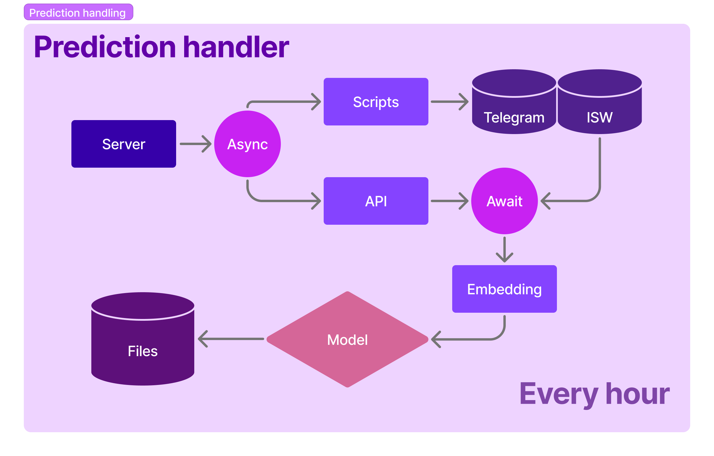
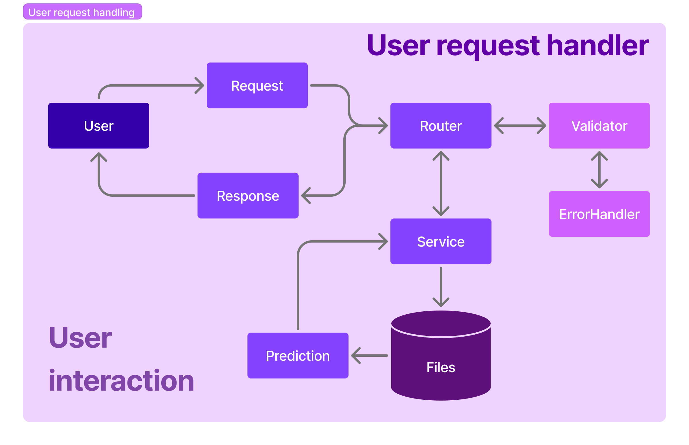
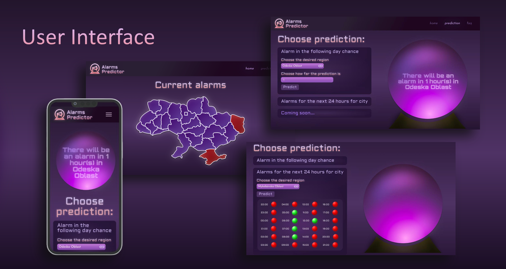

<picture>
  
</picture>

**Table of contents**

- [Project description and problem statement](#project-description-and-problem-statement)
- [Setup project](#setup-project)
- [Run server](#run-server)
- [Setup hourly predictions](#setup-hourly-predictions)
- [System diagrams](#system-diagrams)
- [User Interface](#user-interface)

# Project description and problem statement

Alarms Predictor is a web application designed to forecast air raid alerts across different regions of Ukraine. It is aimed at people who need to schedule their activities in advance and rely on timely information about potential threats.

Air raids are often difficult to predict, since they do not follow a clear pattern and can happen unexpectedly. This project addresses that challenge by using historical data to generate automatic predictions, helping users plan ahead with greater confidence.

The application offers two types predictions:

1. Viewing the probability of an alert for a selected region and a chosen number of hours into the future.
2. Viewing hourly predictions for a selected region covering the full upcoming 24-hour period.

In addition, the application features an interactive map that displays the current alarm status across all regions of Ukraine in real time.

# Setup project

- Clone repository `git clone <path>`
- Go to AirAlarmsApp directory `cd AirAlarmsApp/`
- Create venv `python -m venv <path>` or `.venv python3 -m venv <path>`
- Activate venv `. .venv/bin/activate`
- Install required packages `pip install -r requirements.txt`
- Create `.env` file inside AirAlarmsApp directory according to `.env.sample`;
- If you want to run UI too, you should create `.env` file inside ui directory like in `.env.sample`

# Run server

- Make sure `.venv` is activated and you are inside `AirAlarmsApp/` directory.
- Setup Security Group for your EC2 instance with Custom TCP protocol and port
- Run `uvicorn app.main:app --host 0.0.0.0 --port <custom_port>`

# Setup hourly predictions

- Open crontab file with command `crontab -e`
- Copy this line in crontab file `0 * * * * cd /home/ubuntu/AirAlarmsApp && /home/ubuntu/AirAlarmsApp/.venv/bin/python3.12 -m app.core.hourly_predict >> /home/ubuntu/AirAlarmsApp/storage/hourly.log 2>&1`
As a result, your server will automatically generate and save hourly predictions for air alarms every hour.

# System diagrams

  
  

# User interface
  

