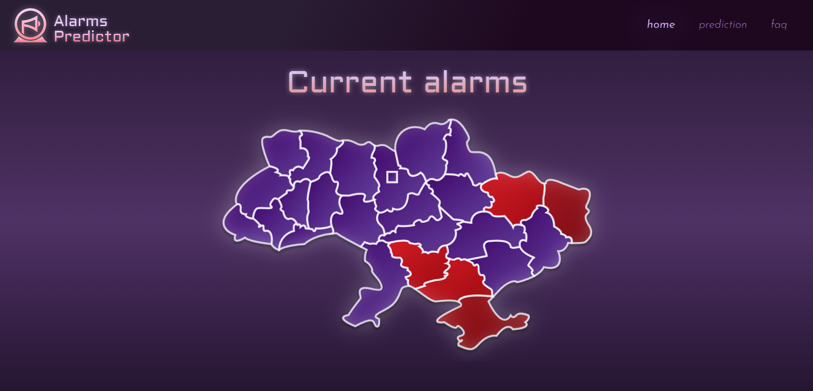

# Alarms Predictor

### Project description and problem statement

Alarms Predictor is a web application designed to forecast air raid alerts across different regions of Ukraine. It is aimed at people who need to schedule their activities in advance and rely on timely information about potential threats.

Air raids are often difficult to predict, since they do not follow a clear pattern and can happen unexpectedly. This project addresses that challenge by using historical data to generate automatic predictions, helping users plan ahead with greater confidence.

The application offers two types predictions:

1. Viewing the probability of an alert for a selected region and a chosen number of hours into the future.
2. Viewing hourly predictions for a selected region covering the full upcoming 24-hour period.

In addition, the application features an interactive map that displays the current alarm status across all regions of Ukraine in real time.

### To setup the project follow the next steps</h2>

- Clone repository `git clone <path>`
- Go to AirAlarmsApp directory `cd AirAlarmsApp/`
- Create venv `python -m venv <path>` or `.venv python3 -m venv <path>`
- Activate venv `. .venv/bin/activate`
- install required packages `pip install -r requirements.txt`
- create .env file inside AirAlarmsApp directory with such keys (telegram keys are optional):
  - TELEGRAM_API_ID
  - TELEGRAM_API_HASH
  - TELEGRAM_API_PHONE
  - WEATHER_API_KEY
  - ALARMS_API_KEY

### To run the server follow the next steps</h2>

- Setup Security Group for your EC2 instance with Custom TCP protocol and port
- (Make sure you are in AirAlarmsApp/ directory with activated venv)
- Run ```uvicorn app.main:app```


### Setup daily ISW scraper </h2>

- Make sure directory `AirAlarmsApp/app/files/isw_reports/full_reports/2025` , `../isw_reports/short_reports` , `../isw_reports/links` exists
- Create file for logs with such path `/home/ubuntu/AirAlarmsApp/files/iswlogs.log`
- Open crontab file with command `crontab -e`
- Copy this line in crontab file `0 23 * * * PYTHONPATH=/home/ubuntu/AirAlarmsApp /home/ubuntu/AirAlarmsApp/.venv/bin/python3.12 -m app.core.scrapers.web_scraper.web_daily_scraper >> /home/ubuntu/AirAlarmsApp/files/iswlogs.log 2>&1`
As a result, your server will load latest daily ISW reports every day at 23:00 (01:00 for Kyiv)


  
### System diagram (deprecated)


### System diagram (updated)
  
  
  
### UI screens
  
  

